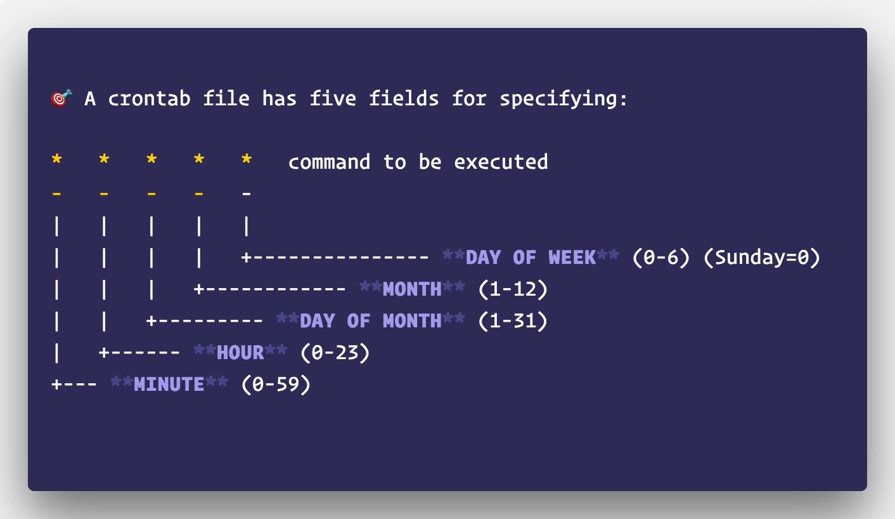

# Agendamento

## Introdução

DAGs são disparadas de duas formas:

- Manualmente por meio da UI ou API.
- Automaticamente por meio de uma política de disparo.

Já para que as DAGs sejam "disparáveis" (i.e. executáveis) elas precisam de:

- Uma data de início a partir do qual podem ser executadas.
- Uma política de disparo que pode ser (além do disparo manual): um intervalo de execução e/ou um critério condicional.

Essas configurações são definidas durante a inicialização (i.e. criação do objeto) da DAG.

## Configurando o Agendamento de DAGs

Chamamos de agendamento (ou escalonamento) o procedimento executado pelo Airflow de definir quando uma DAG deve ser executada.

O agendamento é configurado através de três parâmetros principais: `start_date`, `schedule_interval` e `end_date`. Todos estes parâmetros são atribuidos durante a inicialização da DAG.

- **`start_date` [obrigatório]**. Momento a partir do qual a DAG em questão estará disponível para ser executada. Note que o argumento `start_date` é obrigatório durante a inicialização pois sem uma data de início é impossível para o Airflow saber se a DAG pode ou não ser executada.
- **`schedule_interval`**. Intervalo de execução da DAG. Por padrão, o valor de `schedule_interval` é `None`, o que significa que a DAG em questão só será executada quando triggada manualmente.
- **`end_date`**. Momento até onde a DAG deve ser executada.

Abaixo, um exemplo de uma DAG com escalonamento diário.

```python
dag = DAG(
    dag_id="02_daily_schedule",
    schedule_interval="@daily",
    start_date=dt.datetime(2019, 1, 1),
    ...
)
```

Uma vez definida a DAG, o Airflow irá agendar sua primeira execução para o primeiro intervalo a partir da data de início.

<aside>
⚠️ Se definirmos que uma DAG está disponível para ser executada a partir do dia **09 de Agosto de 2021** às **00hrs** com **intervalo de execução de 15 minutos**, a primeira execução será agendada para 00:15, a segunda execução será agendada para 00:30 e assim sucessivamente.

</aside>

Se não definirmos uma data final, o Airflow irá agendar e executar a DAG em questão eternamente. Assim, caso exista uma data final definitiva a partir do qual a DAG não deverá ser executada, podemos utilizar o argumento `end_date` da mesma forma que `start_date` para limitar os agendamentos.

```python
dag = DAG(
    dag_id="03_with_end_date",
    schedule_interval="@daily",
    start_date=dt.datetime(year=2019, month=1, day=1),
    end_date=dt.datetime(year=2019, month=1, day=5),
)
```

### Intervalos Baseados em Cron

Podemos definir intervalos de execução complexos usando a mesma sintaxe que usamos no [cron](https://cron-job.org/en/).

Basicamente, a sintaxe é composta por cinco componentes organizados da seguinte forma:



O carácter `*` significa que o valor do campo em questão não importa. Assim, podemos definir desde intervalos simples e convencionais:

- `0 * * * *`. Executa a cada hora

Até intervalos mais complexos

- `0 0 1 * *`. Executa a cada primeiro dia do mês (às 00hrs)

Também podemos utilizar de vírgulas (`,`) para definir conjuntos de valores e hífen (`-`) para intervalos de valores. Por exemplo:

- `0 0 * * MON, WED, FRI`. Executa toda segunda, quarta e sexta-feira (às 00hrs)
- `0 0,12 * * MON-FRI`. Executa às 00hrs e 12hrs de segunda à sexta-feira

Alternativamente, podemos recorrer à ferramentas como [crontab.guru](https://crontab.guru/) e [crontab-generator](https://crontab-generator.org/) para definirmos as expressões de forma mais fácil.

O Airflow também fornece alguns macros que podemos utilizar com mais facilidade. Os mais comuns são:

| Macro | Descrição |
| --- | --- |
| @once | Executa uma única vez |
| @hourly | Executa a cada começo de hora |
| @daily | Executa todos os dias às 00hrs |
| @weekly | Executa todo domingo às 00hrs |

### Intervalos Baseados em Frequência

Embora poderosas, expressões cron são incapazes de representar agendamentos baseados em frequência. Por exemplo, não é possível definir (de forma adequada) um intervalo de "três em três em dias".

Por conta disso, o Airflow também aceita instâncias `timedelta` para definir intervalos de execução. Com isso, podemos definir uma DAG que é executada a cada três dias a partir da data de início.

```python
dag = DAG(
    dag_id="04_time_delta",
    schedule_interval=dt.timedelta(days=3),
    start_date=dt.datetime(year=2019, month=1, day=1),
    end_date=dt.datetime(year=2019, month=1, day=5),
)
```

## Catchup & Backfill

Por padrão, o Airflow sempre irá escalonar e executar toda e qualquer execução **passada** que **deveria ter sido executada** mas que por algum motivo **não foi**. Este comportamento é denominado *"backfill"* e é controlado pelo argumento `catchup`  presente na inicialização da DAG.

Caso este comportamento não seja desejado, basta desativá-lo atribuindo `False` ao parâmetro. Dessa forma, o Airflow irá executar a DAG apenas a partir do primeiro intervalo de execução mais próximo.

```python
dag = DAG(
    dag_id="09_no_catchup",
    schedule_interval="@daily",
    start_date=dt.datetime(year=2019, month=1, day=1),
    end_date=dt.datetime(year=2019, month=1, day=5),
    catchup=False,
)
```

**Exemplo:**

Se uma DAG for ativada dentro de um período intervalar, o Airflow irá agendar a execução da DAG para o início deste período.

Por exemplo, considerando uma DAG com `start_date=datetime(2021, 08, 10)` e `schedule_interval="@daily"`; se ativarmos a DAG no dia 15 do mesmo mês às 12hrs, o Airflow irá definir que a primeira execução da DAG deverá ter ocorrido às 00hrs do dia 15 e irá executar a DAG imediatamente.

<aside>
⚠️ Para mudar o valor padrão do `catchup` de `True` para `False`, basta acessar o arquivo de configuração e modificar o parâmetro `catchup_by_default`.

</aside>

Embora o *backfilling* possa ser indesejado em algumas situações, seu uso é muito útil para a reexecução de tarefas históricas.

Por exemplo, suponha as seguintes tarefas `download_data >> process_data`. Considerando que os dados adquiridos através da tarefa `download_data` ainda sejam reacessáveis localmente, podemos realizar as alterações desejadas em `process_data` e então limparmos as execuções passadas (através do botão Clear) para que assim o Airflow reagende e execute a nova implementação de `process_data`.

**Atenção:**

A reexecução das DAGs não ocorre de forma ordenada (i.e. de acordo com a data de execução), mas sim de forma paralela.

Para que o *backfilling* ocorra de forma ordenada, é necessário que o argumento `depends_on_past` presente na inicialização das tarefas seja `True`.

Detalhes sobre o argumento serão apresentados a diante.

### Datas de execução de uma DAG

Em diversas situações é útil sabermos as datas de execução de uma DAG. Por conta disso, o Airflow nos permite acessar tanto a data da execução corrente da DAG, quanto a data da execução imediatamente anterior e posterior.

- `execution_date.` Data da execução corrente de DAG.
    
    Contudo, diferente do que o nome sugere, a data de execução marcada na DAG não é a data em que ela foi executada, mas sim no momento em que ela deveria ser executada, com base no intervalo de execução.
    
    **Exemplo:**
    
    Suponha que temos uma DAG configurada para executar diariamente a partir do dia 2020/01/01.
    
    Após dez dias de execução, fizemos algumas alterações de implementação e agora precisamos que as execuções dos últimos dez dias sejam refeitas. Neste caso, ao acionarmos a opção Clear, as datas de execução da DAG permanecerão de acordo com a data em que foram agendadas originalmente.
    
    Agora, se triggarmos manualmente a DAG antes da próxima execução agendada, a `execution_date` será o momento em que a DAG foi de fato disparada.
    
- `previous_execution_date`. Data de execução (`execution_date`) da DAG anterior.
- `next_execution_date`. Próxima data de execução (`execution_date`) agendada para a DAG.

O acesso a essas informações pode ser feito através do contexto da DAG[^1] ou por meio dos macros pré-definidos:

**Macros:**

| Macro | Descrição |
| --- | --- |
| {{ ds }} | Data de execução no formato YYYY-MM-DD |
| {{ ds_nodash }} | Data de execução no formato YYYYMMDD |
| {{ prev_ds }} | Data de execução anterior no formato YYYY-MM-DD |
| {{ next_ds }} | Próxima data de execução no formato YYYY-MM-DD |

**Uso:**

```python
fetch_events = BashOperator(
    task_id="fetch_events",
    bash_command=(
        f"curl -o /data/events.json {source}"
        "start_date={{ ds }}"
        "end_date={{ next_ds }}"
    ),
    ...
)
```

## Observações

O material desta aula foi fortemente baseado [neste artigo](https://ahayasic.github.io/apache-airflow-in-a-nutshell/content/building_pipelines/scheduling_and_sensors/).